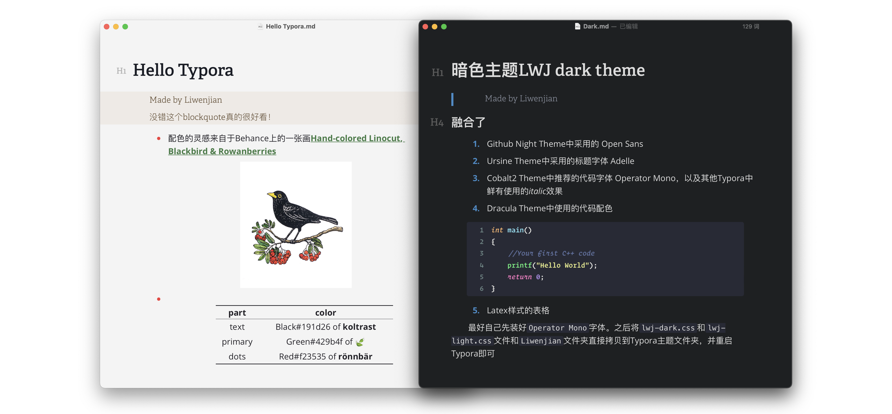

# Liwenjian-Typora-Theme

最好自己先装好`Operator Mono`字体。之后将`lwj-dark.css`和`lwj-light.css`文件和`Liwenjian`文件夹直接拷贝到Typora主题文件夹，并重启Typora即可

It is better to install `Operator Mono` font by yourself first. Copy the `lwj-dark.css`, `lwj-light.css` file and `Liwenjian` folders directly to the Typora theme folder and restart Typora

